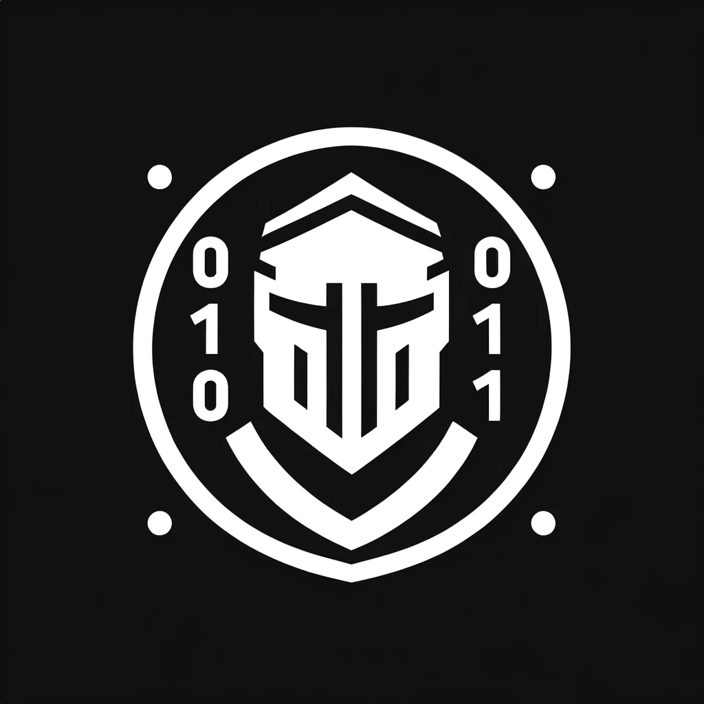

<p align=center>
    <a href="https://github.com/cep-sose2024/binary_knights/" target="_blank"></a>
</p>

A Rust-based wrapper for a crypto abstraction layer that accesses the iOS and macOS Secure Enclave processor.

This is a project in cooperation with j&s-soft GmbH and the Mannheim University of Applied Sciences.

-----------------------------------------------------------------------------------------------------------------------------------------------------------------------------------------------------------------------------------------------------

<h1>Swift-Library in Rust</h1>
<ul>
  <li><a href="#installation">Installation</a></li>
  <li><a href="#commands">Commands required</a></li>
  <li><a href="#code_ausfuehren">How can I execute the code?</a></li>
  <li><a href="#zugriffskontrolle">How to pass access control?</a></li>
  <li><a href="#dev_zertifikat">Where can I find the identifier of my developer certificate?</a></li>
  <li><a href="#entitlements">What can an Entitlement look like?</a></li>
  <li><a href="#compability">Compatibility</a></li>
  <li><a href="#Secure Enclave">Secure Enclave</a></li>
  <li><a href="#dependencies">Dependencies</a></li>
  <li><a href="#license">License</a></li>
</ul>

# 
<h2 id="installation">Installation</h2>

In Visual Studio Code, this repo must be opened and a MachO file must be created using the command 
```
  cargo build
```
must be created. 
This executable file is created in **"\target\debug "**. This cannot yet be executed due to missing entitlements.
We generate it as follows:

Any working Xcode project must be opened in Xcode and the bundle identifier must be set to **en.jssoft.BinaryKnights**.
The app must then be executed, whereby the entitlements are generated, and the storage location in Xcode can be selected by right-clicking on the app.
In this location, right-click on the .app and click on the second button to view the content.
Now open the MacOS folder in the terminal and paste this code:
```
codesign -d --entitlements - --xml "binaryknights" | plutil -convert xml1 -o - -
```
You will be shown the content of an XML file that you need to copy.
Now create the file **binaryknights.entitlements** in the folder **"\target\debug "** and paste the copied content there.

#

<h2 id="commands">Commands required</h2>
The following commands can be helpful when using the Github repo: 

```
cargo build
```
<ul>
  <li>This command is entered in the command line / cmd / terminal to generate the executable / Mach-O file. The executable is then located in the directory: "swift-library_and_rust" --> "target" --> "debug"
  </li>
  <li>ATTENTION!!! <ul>
                    <li>
                      You must be in the "swift-library_and_rust" directory with the command line / cmd / terminal. Otherwise the commands cannot be executed!
                    </li>
                    <li>
                      A new executable is always generated after each build, i.e. the Entitlements + Apple Developer certificate must always be reassigned to the executable.
                    </li>
                  </ul>
  </li>
</ul>

```
cargo run
```
<ul>
  <li>The same points apply as for "cargo build" and</li>
  <li>executes the `main.rs</li>
</ul>

```
cargo clean
```
<ul>
  <li>Cleans all files that were created in the build process.</li>
  <li>Can be executed, for example, if you see error messages that try to execute a directory in a path that does not exist for you. Usually happens when you pull a new version of the repo and another developer builds the files.</li>
</ul>

```
codesign -f -s "[Identifier / hash of the Apple Developer certificate]" --entitlements "[Path to the Entitlement file]" -o runtime -i "[Bundle identifier]" "[Path to the executable / Mach-O file]"
```
<ul>
  <li>Assigns the entitlements + Apple developer certificate to the app / executable</li>
  <li>For the Apple Developer certificate, the identifier / name / hash of the certificate alone is probably sufficient. However, you can also export the correct Apple certificate from the keychain management and assign it by entering a file path.</li>
  <li><b>Example:</b> <br><i>codesign -f -s "Apple Development: dreimer03@googlemail.com (XXXXXXX)" --entitlements "binaryknights.entitlements" rustbinary-calls-swift-package</i></li>
  <li><i>codesign -f -s "5EF477686B05F574A5B6EFB478CCCC5FDDXXXXXX" --entitlements "../../binaryknights.entitlements" -o runtime -i "de.jssoft.-BinaryKnights-1.SecureEnclaveManager" "rust-binary-calls-swift-package"</i></li>
</ul>

```
security find-identity -p codesigning -v
```
  <ul>
    <li>Displays the hash or identifier of the valid Apple Developer certificates that are on the system.</li>
    <li>You can use the hash or the identifier for the command<a href="codesign_set"> codesign </a></li>
    <li>Example of an output:
    <br>
    <i>"1) 5EF477686B05F574A5B6EFB478CCCC5FDDXXXXX "Apple Development: dreimer03@googlemail.com (M995YNXXXX)"
     1 valid identities found"</i>
    </li>
  </ul>

  <h3><i>codesign -d -vvv [File name of the executable]</i></h3>
  <ul>
    <li>Shows which developer team was assigned to the file, which certificate was used to sign the file and which certification authority manages the validity of the certificate.</li>
  </ul>
  
```
codesign -d --entitlements - [Dateiname vom Executable / App]
```
<ul>
  <li>Shows the set entitlements</li>
</ul>

```
codesign -d --entitlements - --xml "binaryknights" | plutil -convert xml1 -o - -
```
<ul>
  <li>Shows the set entitlements in XML format</li>
</ul>
</section>


<section class="second_section">
<h2 id="code_ausfuehren">How can I execute the code?</h2>
<p>As this is a Swift-Rust bridge, the Swift code is mainly accessed via Rust. 
</p>

<p>In the file `swift-library --> main.rs` you can see an example of how to generate a KeyPair (private + public key) in Apple's Secure Enclave with Rust. To do this, you have to run `main.rs` once.
<br>
<br>
Attention!!! It is possible that the code cannot be executed immediately the first time: 
<ul><li>Existing configurations from another system can be transferred with previous builds. Once please <a href="#cargoclean">cargo clean</a> and delete the ".build" files. </li>
<li>
As we are working with entitlements and manually add them with  <a href="#">this command</a> to the Mach-O file after the build process, it is not always sufficient to use <i>cargo run</i> execute the program. It is best to execute the Mach-O file in the Finder itself under "swift-library_and_rust" --> "target" --> "debug". 
</li>
<ul>
</p>
</section>


<hr>


<section class="second_section">
<h2 id="zugriffskontrolle">How to pass access control?</h2>
<p><u>According to current knowledge:</u><br>
With iOS / MacOS apps, you can use certain <a href="https://developer.apple.com/library/archive/documentation/Miscellaneous/Reference/EntitlementKeyReference/Chapters/AboutEntitlements.html">".entitlements"</a> the access rights of the app or of a executable (Mach-O file). The access rights of the app / executable can be set in these entitlements. 
<br>
In our case, it is mainly the keychain sharing service that must be built into the Entitlements to enable access to the Secure Enclave of a Mac. 
<br>
Furthermore, a bundle identifier / application identifier and the team ID must probably be provided. 
The team ID can be found in your Apple Developer certificate
<br><br>
To add the entitlements and the developer certificate to an app / executable, you can use a ready-made command <a href="#codesign_set">"codesign"</a> under the chapter "<a href="#commands"><b>Commands required</b></a>" find. Please replace the elements in the square brackets "[...]" with your customized data. 
</p>
<hr>
</section>


<h2 id="dev_zertifikat">Where can I find the ID of my developer certificate??</h2>
Press the key combination "[cmd] + spacebar" --> Enter "Keychain management" --> Press "Open keychain management" --> "My certificates" / Or search manually for <b>"Apple Development: [e-mail] ([identifier])".
<br><br>
Furthermore, you can enter <a href="#show_certificats">this command</a> in the terminal and also display valid certificates that are stored on the system. 
<hr>

<section class="second_section">
<h2 id="entitlements">What can an entitlement look like?</h2>
Entitlements are structured in an XML format and can be customized using a text editor or an Apple program.
<br>
To use Apple's program, the entitlement must have the extension ".entitlement" and makes it easier to set the correct formatting and access options predefined by Apple.
<br> 
If no Entitlement file can be found, an Executable / Mach-O file can still have one. To do this, use the command <a href="#entitlements_display_xml">here</a> to read them out. 
<br>
The content to be included in the Entitlement must be determined and inserted by the developer (team) themselves. On the Internet, as well as on the <a href="https://developer.apple.com/documentation/bundleresources/entitlements">Apple-Entitlement-Website</a>. 
</section>

<section class="second_section" style="background-color: #0059813d">


-----------------------------------------------------------------------------------------------------------------------------------------------------------------------------------------------------------------------------------------------------

<h2 id="compability">Compability</h2>
All the information provided here is taken from Apple`s [Secure Enclave page](https://support.apple.com/guide/security/secure-enclave-sec59b0b31ff/web "Secure Enclave page from Apple"), where Apple also provides a clear overview. All information retrieved here is **as of 21.04.2024**. The "Supported" column indicates whether the iPhone or iMac is supported by our wrapper.

##### Iphone

| iPhone  | SoC| New SE enhancements of each significant SoC | Supported |
| --------- | --- | :-----:| ----: |
| 5s | A7 | not explicitly mentioned  | No
| 6, 6 Plus   | A8 |  not explicitly mentioned  | No
| 6s, 6s Plus and SE (1st gen)   |  A9  |  "[...] the UID is generated by the Secure Enclave TRNG during manufacturing and written to the fuses using a software process that runs entirely in the Secure Enclave. This process protects the UID from being visible outside the device during manufacturing and therefore isn’t available for access or storage by Apple or any of its suppliers. [...] the AES Engine also includes Dynamic Power Analysis (DPA) countermeasures. [...] the flash storage subsystem is on an isolated bus that’s granted access only to memory containing user data through the DMA crypto engine. "  | No
| 7, 7 Plus     | A10 Fusion  |  "[...] the Secure Enclave Boot ROM locks a hash of the [sepOS](https://support.apple.com/guide/security/aside/secc3e4f7a43/1/web/1 "sepOS") into a register dedicated to this purpose. The Public Key Accelerator uses this hash for operating-system-bound (OS-bound) keys. [...] the PKA supports OS-bound keys, also referred to as [Sealed Key Protection (SKP)](https://support.apple.com/guide/security/sealed-key-protection-skp-secdc7c6c88e/1/web/1 "Sealed Key Protection (SKP)"). These keys are generated using a combination of the device’s UID and the hash of the [sepOS](https://support.apple.com/guide/security/aside/secc3e4f7a43/1/web/1 "sepOS") running on the device. " | Yes
| 8, 8 Plus, X   | A11 Bionic | "[...] includes a memory-protected engine and encrypted memory with anti-replay capabilities, secure boot, a dedicated random number generator, and its own AES engine."  | Yes
| XR, XS, XS Max  | A12 Bionic|   "[...] the Secure Enclave is paired with a Secure Storage Component for entropy storage. The Secure Storage Component is itself designed with immutable ROM code, a hardware random number generator, a per-device unique cryptographic key, cryptography engines, and physical tamper detection. The Secure Enclave and Secure Storage Component communicate using an encrypted and authenticated protocol that provides exclusive access to the entropy." | Yes
| 11, 11 Pro, SE (2nd gen) | A13 Bionic | "[...] the Secure Enclave includes a Boot Monitor designed to ensure stronger integrity on the hash of the booted [sepOS](https://support.apple.com/guide/security/aside/secc3e4f7a43/1/web/1 "sepOS"). [...] the PKA’s [Public Key Accelerator] encryption implementations have been proved to be mathematically correct using formal verification techniques. [...] The hash is provided by the Secure Enclave Boot ROM, or by the Secure Enclave Boot Monitor [...]. These keys are also used to verify the sepOS version when making requests to certain Apple services and are also used to improve the security of passcode-protected data by helping to prevent access to keying material if critical changes are made to the system without user authorization." | Yes
| 12 Mini, 12, 12 Pro, 12 Pro Max    | A14 Bionic  | "[...] the Memory Protection Engine supports two ephemeral memory protection keys. The first is used for data private to the Secure Enclave, and the second is used for data shared with the Secure Neural Engine." | Yes
| 13, 13 Mini, 13 Pro, 13 Pro Max, SE (3rd gen), 14, 14 Plus      | A15 Bionic |    not explicitly mentioned| Yes
| 14 Pro, 14 Pro Max, 15, 15 Plus | A16 Bionic | not explicitly mentioned | Yes
| 15 Pro, 15 Pro Max    | A17 Pro  |   not explicitly mentioned | Yes


##### iMac and MacBook
The wrapper supports Macs with an Apple Silicon processor or Macs with an Intel processor that have a [T2 security chip](https://support.apple.com/en-us/103265 "T2 security chip").
The same also applies to MacBooks. In addition, the MacBook Pro 2016 and 2017, which have Touch Bar (these have a T1 security chip), are **not** supported.

# 

<h2 id="Secure Enclave">Secure Enclave</h2>
> "The Secure Enclave is a dedicated secure subsystem integrated into Apple systems on chip (SoCs). The Secure Enclave is isolated from the main processor to provide an extra layer of security and is designed to keep sensitive user data secure even when the Application Processor kernel becomes compromised. It follows the same design principles as the SoC does—a boot ROM to establish a hardware root of trust, an AES engine for efficient and secure cryptographic operations, and protected memory. Although the Secure Enclave doesn’t include storage, it has a mechanism to store information securely on attached storage separate from the NAND flash storage that’s used by the Application Processor and operating system." ~ <a href="https://support.apple.com/guide/security/secure-enclave-sec59b0b31ff/web">Secure Enclave - Apple</a>
<p align=center> <a href="https://support.apple.com/guide/security/secure-enclave-sec59b0b31ff/web" target="_blank"></a> </p>


<h2 id="dependencies">Dependencies</h2>
<p>This Github repo is the Swift-Rust bridge from <a>chinedufn</a> <a href="https://github.com/chinedufn/swift-bridge/tree/ef01d21001914b79e0384627535098e15f87f096/examples/rust-binary-calls-swift-package">rust-binary-calls-swift-package</a>, which is licensed under the MIT License.
<br>
Our SecureEnclaveManager code, from our current <b>main branch</b>, has been implemented in the `swift-library` folder.
</p>

We made several modifications to adapt the code for our project.


<h2 id="license">License</h2>

[MIT](https://choosealicense.com/licenses/mit/)


