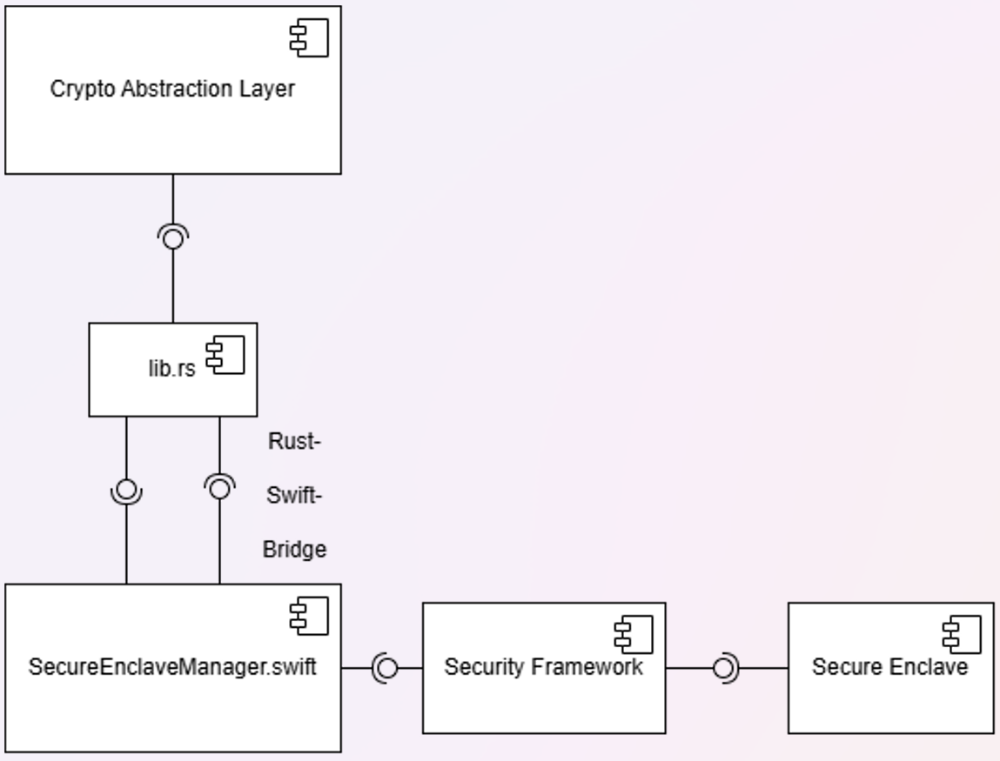

# Secure Enclave Swift-Rust Wrapper


<p align=center>
    <a href="https://github.com/cep-sose2024/binary_knights/" target="_blank"></a>
</p>

A Rust- and Swift-based Wrapper for a Crypto Abstraction Layer that accesses the iOS and macOS Secure Enclave Processor.

This is a project in cooperation with j&s-soft GmbH and the Mannheim University of Applied Sciences.

## Table of Contents

- [Secure Enclave](#secure-enclave)
- [Architecture](#architecture)
- [Compatibility](#compatibility)
- [Requirements](#requirements)
- [Installation](#installation)
- [Features](#features)
- [Code Usage](#code-usage)
- [Implementation](#implementation)
- [Dependencies](#depenencies)
- [License](#license)

## Secure Enclave


"The Secure Enclave is a dedicated secure subsystem integrated into Apple systems on chip (SoCs). The Secure Enclave is isolated from the main processor to provide an extra layer of security and is designed to keep sensitive user data secure even when the Application Processor kernel becomes compromised. It follows the same design principles as the SoC does—a boot ROM to establish a hardware root of trust, an AES engine for efficient and secure cryptographic operations, and protected memory. Although the Secure Enclave doesn’t include storage, it has a mechanism to store information securely on attached storage separate from the NAND flash storage that’s used by the Application Processor and operating system." ~ 
<a href="https://support.apple.com/guide/security/secure-enclave-sec59b0b31ff/web">Secure Enclave - Apple</a>

Security can be guaranteed as the Secure Enclave Processor (main computing power for the Secure Enclave) is isolated and only dedicated for Secure Enclave use. This helps prevent side-channel attacks that depend on malicious software sharing the same execution core as the target software under attack. In addition, the Secure Enclave Processor is designed to operate efficiently at a lower clock speed that helps protect it against clock and power attacks.

<p> <a href="https://support.apple.com/guide/security/secure-enclave-sec59b0b31ff/web" target="_blank"></a> </p>


## Architecture



### Crypto Abstraction Layer:

The Crypto Abstraction Layer is provided by j&s-soft GmbH and is used as a comprehensive and flexible cryptographic library designed to provide a unified interface for various cryptographic operations and algorithms. It offers a wide range of functionalities, including encryption, decryption, signing, signature verification, and hashing, while supporting both symmetric and asymmetric cryptography. 

### Rust Library:

The Rust Code in `lib.rs` is used as an library between the Crypto Abstraction Layer and the Rust-Swift-Bridge. 
This enables using the Swift functions in Rust and calling them from the Crypto Abstraction Layer.

### Rust-Swift-Bridge (FFI):

The Rust-Swift-Bridge by chinedufn is used as an FFI (Foreign Function Interface) to make calling Swift functions in Rust possible. 
Data types can be passed and shared between Rust and Swift. Using the bridge is "safer, more performant and more ergonomic than managing a Rust and Swift FFI by hand" ~ [Swift-Bridge by chinedufn](https://github.com/chinedufn/swift-bridge). 
Not all data types are supported by the bridge as well as the error handling, that's why strings and booleans are used to keep passing the parameters easy. 
The reason why this bridge is chosen is that it is the newest in comparison to other Rust-Swift-Bridges. 
In addition, it also was the easiest to get into it and start coding.

### Swift Wrapper:

The Swift implementation in ```SecureEnclaveManager.swift```is an important step for accessing the Secure Enclave as the main logic is implemented in Swift. 
The most essential functions are creating and loading a key, initializing a module, encrypting and decrypting data, and signing and also verifying the signature.

### Security Framework

The Security framework is an important part of the implementation. 
It works as an API to access the Secure Enclave with already written functions. 
To keep the security on the implementation, the framework protects information, establishes trust, and controls access to software.
To read more about this, the documentation is [here](https://developer.apple.com/documentation/Security).

### Secure Enclave:

The [Secure Enclave](#secure-enclave) is important in this project for secure encryption, decryption, signing and verifying of data. 
The [requirements](#requirements) for accessing the Secure Enclave are using a native programming language of Apple, in this case Swift.
Additionally, an [Apple Developer Account](#developer-account) is needed for enabling the necessary entitlements. 


## Compatibility

All the information provided here is taken from Apple`s [Secure Enclave page](https://support.apple.com/guide/security/secure-enclave-sec59b0b31ff/web "Secure Enclave page from Apple"), where Apple also provides a clear overview. All information retrieved here is **as of 21.04.2024**. The "Supported" column indicates whether the iPhone or iMac is supported by our wrapper.

### Iphone

| iPhone  | SoC| New SE enhancements of each significant SoC | Supported |
| --------- | --- | :-----:| ----: |
| 5s | A7 | not explicitly mentioned  | No
| 6, 6 Plus   | A8 |  not explicitly mentioned  | No
| 6s, 6s Plus and SE (1st gen)   |  A9  |  "[...] the UID is generated by the Secure Enclave TRNG during manufacturing and written to the fuses using a software process that runs entirely in the Secure Enclave. This process protects the UID from being visible outside the device during manufacturing and therefore isn’t available for access or storage by Apple or any of its suppliers. [...] the AES Engine also includes Dynamic Power Analysis (DPA) countermeasures. [...] the flash storage subsystem is on an isolated bus that’s granted access only to memory containing user data through the DMA crypto engine. "  | No
| 7, 7 Plus     | A10 Fusion  |  "[...] the Secure Enclave Boot ROM locks a hash of the [sepOS](https://support.apple.com/guide/security/aside/secc3e4f7a43/1/web/1 "sepOS") into a register dedicated to this purpose. The Public Key Accelerator uses this hash for operating-system-bound (OS-bound) keys. [...] the PKA supports OS-bound keys, also referred to as [Sealed Key Protection (SKP)](https://support.apple.com/guide/security/sealed-key-protection-skp-secdc7c6c88e/1/web/1 "Sealed Key Protection (SKP)"). These keys are generated using a combination of the device’s UID and the hash of the [sepOS](https://support.apple.com/guide/security/aside/secc3e4f7a43/1/web/1 "sepOS") running on the device. " | Yes
| 8, 8 Plus, X   | A11 Bionic | "[...] includes a memory-protected engine and encrypted memory with anti-replay capabilities, secure boot, a dedicated random number generator, and its own AES engine."  | Yes
| XR, XS, XS Max  | A12 Bionic|   "[...] the Secure Enclave is paired with a Secure Storage Component for entropy storage. The Secure Storage Component is itself designed with immutable ROM code, a hardware random number generator, a per-device unique cryptographic key, cryptography engines, and physical tamper detection. The Secure Enclave and Secure Storage Component communicate using an encrypted and authenticated protocol that provides exclusive access to the entropy." | Yes
| 11, 11 Pro, SE (2nd gen) | A13 Bionic | "[...] the Secure Enclave includes a Boot Monitor designed to ensure stronger integrity on the hash of the booted [sepOS](https://support.apple.com/guide/security/aside/secc3e4f7a43/1/web/1 "sepOS"). [...] the PKA’s [Public Key Accelerator] encryption implementations have been proved to be mathematically correct using formal verification techniques. [...] The hash is provided by the Secure Enclave Boot ROM, or by the Secure Enclave Boot Monitor [...]. These keys are also used to verify the sepOS version when making requests to certain Apple services and are also used to improve the security of passcode-protected data by helping to prevent access to keying material if critical changes are made to the system without user authorization." | Yes
| 12 Mini, 12, 12 Pro, 12 Pro Max    | A14 Bionic  | "[...] the Memory Protection Engine supports two ephemeral memory protection keys. The first is used for data private to the Secure Enclave, and the second is used for data shared with the Secure Neural Engine." | Yes
| 13, 13 Mini, 13 Pro, 13 Pro Max, SE (3rd gen), 14, 14 Plus      | A15 Bionic |    not explicitly mentioned| Yes
| 14 Pro, 14 Pro Max, 15, 15 Plus | A16 Bionic | not explicitly mentioned | Yes
| 15 Pro, 15 Pro Max    | A17 Pro  |   not explicitly mentioned | Yes


### iMac and MacBook
The wrapper supports Macs with an Apple Silicon processor or Macs with an Intel processor that have a [T2 security chip](https://support.apple.com/en-us/103265 "T2 security chip").
The same also applies to MacBooks. In addition, the MacBook Pro 2016 and 2017, which have Touch Bar (these have a T1 security chip), are **not** supported.


## Features

This wrapper supports cryptographic operations and algorithms on the Secure Enclave.
These are the most important ones:
- Creating a key
- Loading a key
- Initializing a module
- Encryption
- Decryption
- Signing
- Verifying

The supported algorithms for the wrapper are these ones:
- Encryption Algorithms: 
    - Asymmetric Encryption: RSA

- Signing Algorithms:
    - RSA
    - ECDSA (according to the documentation of Apple, kSecAttrKeyTypeECDSA and kSecAttrKeyTypeECSECPrimeRandom is used instead for ECDSA)

- Hashing Algorithms:
    - SHA224
    - SHA256
    - SHA384

Even though it is mentioned in the Abstraction Layer, SHA1 is not supported here, as it is not considered as secure anymore.

## Requirements

### Hardware

To execute and develope the code, a MacBook with a Secure Enclave is needed, see [Compatibility](#compatibility).

### Software

Visual Studio Code is needed for executing the Rust code and building the Mach-O file.
For the Entitlements with the Bundle Identifier to access the Secure Enclave, Xcode is necessary.

### Developer Account

The Apple Developer Account is necessary to access the Secure Enclave. 
It is important to not only having the account, but also the rights permissions as an App Manager, as Xcode sets the entitlements with the Bundle Identifier automatically. 
That means that there won't be any problems executing the Swift code in Xcode, but in VS Code.

## Installation

### Visual Studio Code

To install this project in Visual Studio Code, the code has to be cloned. 
For making the Rust Code executable, Rust has to be installed on the device: [Install rustup](https://www.rust-lang.org/tools/install).
If the Rust Code has to be developed in Visual Studio Code, it is recommended to install the Rust-Analyzer Extension to make the developing easier.
The Swift Extension in Visual Studio Code can be installed optionally if the Swift code has to be developed in Visual Studio Code.
However, it is recommended to do this directly in [Xcode](#xcode).

### Xcode

The newest version of Xcode has to be installed. This can be done in the App Store and only on a macOS device.
The Swift code should be developed in Xcode, as this is the official IDE for Swift.
It has integrated tools and certificates with the Apple Developer Account have to be created via Xcode.

### Apple Developer Account

For having any access on the Secure Enclave, an [Apple Developer Account](https://developer.apple.com/) is needed for ensuring security on the one hand and for executing the code on physical devices and not only in the simulator.
Also, it plays a major role for the signing process, described in [Commands](#commands).
The role for the account has to be set to **App Manager**.
The Apple Developer Account is also necessary for developing the Swift code, for example for using the Keychain Services to store cryptographic keys securely.
Furthermore, the entitlements can only be set by using the right Bundle Identifier. 

To do this, the Xcode project has to be opened and under **Signing & Capabilities**, the Bundle Identifier needs to be set to **de.jssoft.BinaryKnights**.
Also, it is important that the development team is not the Personal Team but the j&s soft team. 
This is not possible if the role of the Developer Account isn't set to App Manager.
If the error message is "Failed Registering Bundle Identifier" and "No profiles for 'XXX' were found", then it's probably because of the missing role in the Developer Account. 
To add an account, logging in with the Apple-ID is necessary.


### Commands

After installing everything, the Executable can be made by using `cargo build` in the terminal in Visual Studio Code. 
This command has to be used in the directory `binaryknights_rust_crypto`, otherwise the commands cannot be executed.


Now, the Executable can be found in `/main/target/debug/` as a Mach-O (Mach Object File Format), which is used in macOS and iOS operating systems. 

The created Executable file cannot be executed yet due to missing entitlements. 
To give the Mach-O file the right entitlements, the command 
`codesign -f -s "[certificate]" --entitlements "[path to entitlements file]" -o runtime -i "de.jssoft.BinaryKnights" "rustbinary-calls-swift-package"` has to be used.

`codesign` is a tool used to sign code, verifying the identity of the author and ensuring the integrity of the code on macOS.

With `-f`, the code signature is forced to be replaced if the binary is already signed.

With `-s`, the signing identity is specified with the certificate used for signing. 
For the certificate, a hash of the valid code signing Apple Developer certificate in the keychain has to be used. 
To find the hash, the coammand `security find-identity -p codesigning -v` has to be used.
It shows all of the Apple Developer certficates that are stored on the system.
An example can look like this: `XXXXXXXXXXXXXXXXXXXXXXXXXX "Apple Development: example@mail.com (XXXXXXXXXX)" 1 valid identities found"`.
In the brackets is the identifier for the Apple Developer certificate. 
It can be easily found in the Keychain Access under **My Certificates**. 

`--entitlements` specifies the entitlements file that is used, followed by the path to the file.

`-o runtime` is used to enable the hardened runtime to make an exploit more difficult. It is a set of security restrictions by Apple.

`-i` specifies the identifier, in this case the Bundle Identifier that is **de.jssoft.BinaryKnights**.

At the end, the path to the binary has to be set, in this case it is the Mach-O file **rustbinary-calls-swift-package**

Here are more useful commands in terms of entitlements:

- `codesign -d -vvv [file name]`: shows the Bundle Identifier, the format of the file, the Apple Team ID.
- `codesign -d --entitlements - [file name]`: shows the entitlements that are set on the file.
- `codesign -d --entitlements - --xml "binaryknights" | plutil -convert xml1 -o - -`: shows the entitlements that are set on the file and converts the output to XML format


After every build, a new Executable is generated and the Mach-O file has to be signed with every Executable.
Before building a new Mach-O file with `cargo build`, `cargo clean` has to be used to delete all generated build files and the Mach-O file itself.

To exectute the Mach-O file, the path has to be typed into the terminal.


## Code Usage

Here are some usage examples:

In the following code, the used variables for the key ID, used string to encrypt, algorithm etc. are defined for futher usage.
```rust
let key_id = "Beispiel4";
let string = "Hello, world!";
let logger = Logger::new_boxed();
let tpm_provider = SecModules::get_instance(key_id.to_string(), SecurityModule::Tpm(TpmType::MacOs), Some(logger)).expect("Failed to create TPM provider"); 
let asym_algorithm = AsymmetricEncryption::Rsa(KeyBits::Bits1024);
let hash = Hash::Sha2(Sha2Bits::Sha256); 
let key_usages = vec![KeyUsage::SignEncrypt, KeyUsage::Decrypt];
let config: SecureEnclaveConfig = SecureEnclaveConfig::new( Some(asym_algorithm), Some(hash));
```

### Initializing a module

Before using the cryptographic operations, the Secure Enclave has to be inizialized for accessing the Secure Enclave.
Here is an example of how to do this:

```rust
match tpm_provider.lock().unwrap().initialize_module() {
    Ok(()) => println!("TPM module initialized successfully"),
    Err(e) => println!("Failed to initialize TPM module: {:?}", e),
}
```

### Creating a key

An cryptographic keypair has to be created, a private key and a public key:

```rust
match tpm_provider.lock().unwrap().create_key(key_id,Box::new(config.clone())) {
    Ok(()) => println!("Key created successfully"),
    Err(e) => println!("Failed to create key: {:?}", e)
}; 
```

### Loading a key

Loading the key just created is necessary for further cryptographic operations:

```rust
match tpm_provider.lock().unwrap().load_key(key_id, Box::new(config.clone())) {
    Ok(()) => println!("Key existing and ready for operations"),
    Err(e) => println!("Failed to load Key: {:?}", e),
}
```


### Encryption

Here is an example of how the string `"Hello, world!"` is encrypted.
It is converted to a byte array before encryping:

```rust
let mut encrypted_data_bytes: Vec<u8> = Vec::new();
let data = string.as_bytes();

match tpm_provider.lock().unwrap().encrypt_data(data) {
    Ok(encrypted_data) => {
        encrypted_data_bytes = encrypted_data;
        println!("\nEncrypted '{}' as Byte Array: \n{:?}", string, encrypted_data_bytes);
    }
    Err(e) => println!("Failed to encrypt data: {:?}", e),
}
```

### Decryption

The previoulsy encrypted data has to be decrypted to, so this is how to do it:

```rust
match tpm_provider.lock().unwrap().decrypt_data(&encrypted_data_bytes) {
    Ok(decrypted_data) => println!("DecryptedData of {}: \n{:?}", String::from_utf8_lossy(&encrypted_data_bytes).to_string(),   
        String::from_utf8(decrypted_data)),
    Err(e) => println!("Failed to decrypt data: {:?}", e),
}
```

### Signing

Here, the string `"Hello, world!"` is signed:

```rust
let mut signed_data_bytes: Vec<u8> = Vec::new(); 
let data = string.as_bytes();

match tpm_provider.lock().unwrap().sign_data(data) {
    Ok(signature) => {
        signed_data_bytes = signature.clone(); 
        println!("Signature of '{}' => \n{:?}", string, signature)},
    Err(e) => println!("Failed to sign data: {:?}", e),
}; 
```


### Verifying

Verifying a signature is important to make sure that a document is valid and not changed by a third party.
Here is an example of how to verify the just signed data and check if the signature is valid or invalid:

```rust
let data = string.as_bytes();

match tpm_provider.lock().unwrap().verify_signature(data, &signed_data_bytes) {
    Ok(valid) => {
        if valid {
            println!("Signature of {} and {:?} is valid", string, signed_data_bytes);
        } else {
            println!("Signature of {} and {:?} is invalid", string, signed_data_bytes);
        }
    }
    Err(e) => println!("Failed to verify signature: {:?}", e),
}
```


## Implementation

### Usage of the Rust-Swift Bridge

The main functions have a **rustcall** version that calls the function with the implemented logic. 
This is required, as the Rust-Swift-Bridge cannot pass all of the data types, especially the ones from the Security framework and the Core Foundation. 
The possible data types are documented in the `README.md` [here:](https://github.com/chinedufn/swift-bridge)
To make an implementation with Rust still possible, these parameters had to be changed to another data type:
- most of the parameters have to be converted to a string
- the passed data is represented as a vector of 8-bit unsigned integers
- the errors are represented as a string and a boolean is returned to indicate that there is an error 

Here are some examples of how this is handled:

```swift
func encrypt_data(data: CFData, public_key: SecKey, algorithm: SecKeyAlgorithm) throws -> CFData?
```
Here, there are data types like `CFData`, `SecKey` and `SecKeyAlgorithm`. These cannot be passed over the bridge, so there is the `rustcall_encrypt_data` version of this function to enable passing the parameters. 
In the following example, the `key_id`, `algorithm` and `hash` have to be converted to a string and `data`is represented as a vector of 8-bit unsigned integers. 
The reason why `algorithm` and `hash` are devided here is that in the Security framework the algorithms are already combined, e.g. `rsaEncryptionOAEPSHA224` which stands for RSA as the algorithm and SHA224 as the hashing algorithm.

```swift
func rustcall_encrypt_data(key_id: RustString, data: RustVec<UInt8>, algorithm: RustString, hash: RustString) -> (Bool, String)
```

The following code is a excerpt from `lib.rs` that is used for passing the functions from Swift to Rust.
The `rustcall_encrypt_data` from `SecureEnclaveManager.swift` function is called from this Rust function over the Rust-Swift-Bridge.

```rust
use crate::ffi;
pub fn rust_crypto_call_encrypt_data(key_id: String, data: Vec<u8>, algorithm: String, hash: String) -> (bool, String) {
    ffi::rustcall_encrypt_data(key_id, data, algorithm, hash)
}
```


### Creating a key

In Swift, the function `SecKeyCreateRandomKey` from the Security framework is used to generate a new public-private key pair. 
The function `get_public_key_from_private_key` returns a SecKeyCopyPublicKey that is the public key associated with the given private key.
`SEKeyPair` is a structure used to store the public and private key together.

```swift
guard let privateKeyReference = SecKeyCreateRandomKey(params as CFDictionary, &error) else {
    throw SecureEnclaveError.CreateKeyError("A new public-private key pair could not be generated. \(String(describing: error))")
}
        
guard let publicKey = get_public_key_from_private_key(private_key: privateKeyReference) else {
    throw SecureEnclaveError.CreateKeyError("Public key could not be received from the private key. \(String(describing: error))")
}
        
let keyPair = SEKeyPair(publicKey: publicKey, privateKey: privateKeyReference)
```
The following code is from `provider.rs` in the Crypto Abstraction Layer. 
It calls the Swift function that contains the code shown above (`rustcall_create_key` which calls `create_key` from `SecureEnclaveManager.swift`).
Before the key is created, the algorithms are checked for creating the key with its matching algorithm.
Here, it is checked if there is any error, and if not, `Ok(())` is returned to indicate creating loading the key was successful:
```rust
let keypair = apple_secure_enclave_bindings::provider::rust_crypto_call_create_key(self.key_id.clone(), key_algorithm_type);
    if keypair.0 {
        Err(SecurityModuleError::InitializationError(keypair.1.to_string()))
    } else {
        Ok(())
    }
```

### Loading a key


Returns one or more keychain items that match a search query, or copies attributes of specific keychain items
```swift
let status = SecItemCopyMatching(query as CFDictionary, &item)
```

The following code is from `provider.rs` in the Crypto Abstraction Layer. 
It calls the Swift function that contains the code shown above (`rustcall_load_key` which calls `load_key` from `SecureEnclaveManager.swift`).
Here, it is checked if there is any error, and if not, `Ok(())` is returned to indicate that loading the key was successful:
```rust
let load_key = apple_secure_enclave_bindings::provider::rust_crypto_call_load_key(_key_id.to_string(), algorithm, hash);
if load_key.0 {
    return Err(SecurityModuleError::InitializationError(load_key.1.to_string()))
}
return Ok(())
```


### Initializing a module

In this function, it is checked if the macOS version is 10.15 or later by using the `#available` keyword.
Also, it is checked if the device supports Secure Enclave access. 
If the Secure Enclave is available, the function returns true, and if not, it returns false.
```swift
if #available(macOS 10.15, *) {
    do{
        guard SecureEnclave.isAvailable else {
            throw SecureEnclaveError.runtimeError("Secure Enclave is unavailable on this device. ")
        }
        return true
    }catch{
        return false
    }
} else {
    return true
}
```


The following code is from `provider.rs` in the Crypto Abstraction Layer. 
It calls the Swift function that contains the code shown above (`initialize_module` from `SecureEnclaveManager.swift`).
Here, it is checked if the return value matches `true` to show if inizialization has been successful or if an error has to be returned:
```rust
let initialization_result = apple_secure_enclave_bindings::provider::rust_crypto_call_initialize_module();
match initialization_result {
    true => Ok(()),
    false => Err(SecurityModuleError::InitializationError(
        "Failed to initialize module".to_string(),
    )),
}
```


### Encryption

In Swift, the function `SecKeyCreateEncryptedData` from the Security framework is used to encrypt a block of data using a public key and a specified algorithm:
```swift
let result = SecKeyCreateEncryptedData(public_key, algorithm, data, &error)
```

The following code is from `key_handle.rs` in the Crypto Abstraction Layer. 
It calls the Swift function that contains the code shown above (`rustcall_encrypt_data` which calls `encrypt_data` from `SecureEnclaveManager.swift`).
Here, it is checked if there is any error, and if not, the return value as a string is converted into a `Vec<u8>`:
```rust
let encrypted_data = apple_secure_enclave_bindings::keyhandle::rust_crypto_call_encrypt_data(key_id.to_string(), data_vec, algorithm, hash);
if encrypted_data.0 {
    Err(SecurityModuleError::EncryptionError(
        encrypted_data.1.to_string(),
        ))
} else {
    Ok(encrypted_data.1.into_bytes())
}
```

### Decryption

To decrypt a block of data using a private key and specified algorithm from the previously encrypted data, the function `SecKeyCreateDecryptedData` from the Security framework is used:
```swift
let result = SecKeyCreateDecryptedData(private_key, algorithm, data, &error)
```

The following code is from `key_handle.rs` in the Crypto Abstraction Layer. 
It calls the Swift function that contains the code shown above (`rustcall_decrypt_data` which calls `decrypt_data` from `SecureEnclaveManager.swift`).
Here, it is checked if there is any error, and if not, the return value as a string is converted into a `Vec<u8>`:
```rust
let decrypted_data = apple_secure_enclave_bindings::keyhandle::rust_crypto_call_decrypt_data(self.key_id.to_string(), encrypted_data_vec, algorithm, hash);
if decrypted_data.0 {
    Err(SecurityModuleError::EncryptionError(decrypted_data.1.to_string()))
} else {
    Ok(decrypted_data.1.into_bytes())
}
```

### Signing

For signing a block of data using a private key and specified algorithm, the function `SecKeyCreateSignature` from the Security framework is used:
```swift
guard let signed_data = SecKeyCreateSignature(privateKey, sign_algorithm, data, &error)
```

The following code is from `key_handle.rs` in the Crypto Abstraction Layer. 
It calls the Swift function that contains the code shown above (`rustcall_sign_data` which calls `sign_data` from `SecureEnclaveManager.swift`).
Here, it is checked if there is any error, and if not, the return value as a string is converted into a `Vec<u8>`:
```rust
let signed_data = apple_secure_enclave_bindings::keyhandle::rust_crypto_call_sign_data(key_id.clone(), data_vec, algo, hash);

if signed_data.0 {
    Err(SecurityModuleError::EncryptionError(signed_data.1.to_string()))
} else {
    Ok(signed_data.1.into_bytes())
}
```

### Verifying

For verifying the signature of a block of data using a public key and specified algorithm, the function `SecKeyVerifySignature` is used which returns a boolean. In this implementation, the boolean is also returned:

```swift
if SecKeyVerifySignature(public_key, sign_algorithm, data, signature, &error){
    return true
} else{
    return false
}
```

The following code is from `key_handle.rs` in the Crypto Abstraction Layer. 
It calls the Swift function that contains the code shown above (`rustcall_verify_data` which calls `verify_data` from `SecureEnclaveManager.swift`).
Here, it is checked if the return value is `true` and with this the signature is valid, or `false` and the signature is not valid:
```rust
let verification_result = apple_secure_enclave_bindings::keyhandle::rust_crypto_call_verify_signature(key_id.clone(), data_vec, signature_vec, algo, hash);
match verification_result.1.as_str() {
    "true" => Ok(true),
    "false" => Ok(false),
    _ => Err(SecurityModuleError::SignatureVerificationError(
        verification_result.1,
    ))
}
```

### Error Handling

In `SecureEnclaveManager.swift`, a `SecureEnclaveError`is used as an enum for errors.
It is devided into more specific errors for every functionality:

- `runtimeError`: is thrown if the Secure Enclave is not available on the device.

- `SigningError`: is used when there are any errors during signing, so the data cannot be signed. 
In addition, it is used when the hash for the signature is not supported.

- `DecryptionError`: is used when there is an error occurring while trying to decrypt, so the data cannot be decrypted.

- `EncryptionError`: is used when the data cannot be encrypted, so an error is occurring. This can happen when the algorithm, hash or keytype are not supported.

- `SignatureVerificationError`: is used when there is an error occurring while trying to verify the signature. 
This can happen for example due to an invalid message 

- `InitializationError`: is used when the Mach-O file isn't signed so the Secure Enclave couldn't be accessed.

- `CreateKeyError`: is used to indicate that there is any error while trying to create a keypair.

- `LoadKeyError`: is used when the key could not be found and thus not loaded


As there are difficulties to pass errors over the Rust-Swift-Bridge, the error messages are converted into a string. 
The string and a boolean that is `true` if there is any error are returned and then also passed to Rust as a String.


## Dependencies
This Github repo is the Rust-Swift-Bridge by chinedufn  [rust-binary-calls-swift-package](https://github.com/chinedufn/swift-bridge/tree/ef01d21001914b79e0384627535098e15f87f096/examples/rust-binary-calls-swift-package), which is licensed under the MIT License.

Our SecureEnclaveManager code, from our current <b>main branch</b>, has been implemented in the `swift-library` folder.

We made several modifications to adapt the code for our project.


## License

[MIT](https://choosealicense.com/licenses/mit/)


