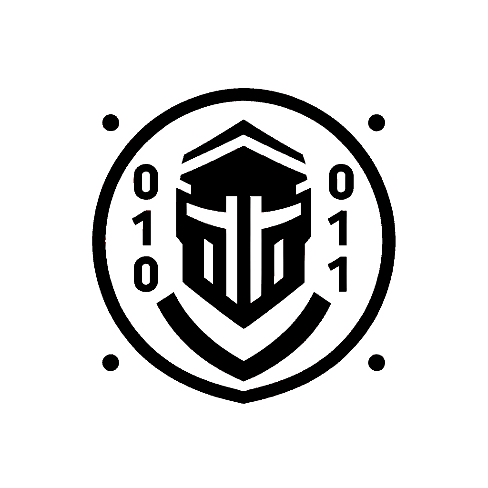

<p align=center>
    <a href="https://github.com/cep-sose2024/binary_knights/" target="_blank"></a>
</p>

A Rust-based wrapper for a crypto abstraction layer that accesses the iOS and macOS Secure Enclave processor.

This is a project in cooperation with j&s-soft GmbH and the Mannheim University of Applied Sciences.

---

# Secure Enclave Wrapper

- [Introduction](#introduction)
- [Secure Enclave Explanation](#secure-enclave-explanation)
- [Architecture](#architecture)
- [Prerequisites](#prerequisites)
    - [Hardware](#hardware)
    - [Software](#software)
    - [Developer Account](#developer-account)
- [Compatibility](#compatibility)
- [Supported Algorithms](#supported-algorithms)
- [Installation](#installation)
- [Code Examples](#code-examples)
- [Dependencies](#dependencies)
- [License](#license)

---

## Introduction
A wrapper implementation of the HSM interface for macOS and iOS to ensure secure key management using Apple's Secure Enclave.

## Secure Enclave Explanation
The Secure Enclave is a secure coprocessor integrated into Apple devices that protects sensitive data even if the main operating system is compromised. It utilizes a hardware root of trust, an AES engine, and protected memory to ensure security. Although it does not have its own storage, it can securely store data on attached storage devices. The Secure Enclave operates independently from the main processor, increasing overall system security.

## Architecture
(To be provided.)

## Prerequisites

### Hardware
- All devices with a T2 chip:
  - iMac (2017 or later)
  - iMac Pro
  - Mac Pro (2019 or later)
  - Mac mini (2018 or later)
  - MacBook Air (2018 or later)
  - MacBook Pro (2016 or later)

### Software
- Xcode, tested on version 13
- VSCode version 1.90 Universal
- Rust version 1.78

### Developer Account
- Please consult your system administrator.

## Compatibility
(Skipped)

## Supported Algorithms
- RSA with SHA1
- RSA with SHA224
- RSA with SHA256
- RSA with SHA384

## Installation
### Installation
In Visual Studio Code, open this repo and create a MachO file using the command:
```
cargo build
```
This executable file is created in **"	arget\debug"**. This cannot yet be executed due to missing entitlements. We generate it as follows:

Open any working Xcode project in Xcode and set the bundle identifier to **en.jssoft.BinaryKnights**. Execute the app, generating the entitlements, and select the storage location in Xcode by right-clicking on the app. In this location, right-click on the .app and click on the second button to view the content. Now open the MacOS folder in the terminal and paste this code:
```
codesign -d --entitlements - --xml "binaryknights" | plutil -convert xml1 -o - -
```
You will be shown the content of an XML file that you need to copy. Now create the file **binaryknights.entitlements** in the folder **"	arget\debug"** and paste the copied content there.

## Code Examples
### How to Execute the Code
As this is a Swift-Rust bridge, the Swift code is mainly accessed via Rust.

In the file `swift-library --> main.rs`, you can see an example of how to generate a KeyPair (private + public key) in Apple's Secure Enclave with Rust. To do this, run `main.rs` once.

Attention!!! It is possible that the code cannot be executed immediately the first time:
- Existing configurations from another system can be transferred with previous builds. Please run `cargo clean` and delete the ".build" files.
- As we are working with entitlements and manually add them with `this command` to the Mach-O file after the build process, it is not always sufficient to use `cargo run` to execute the program. It is best to execute the Mach-O file in the Finder itself under "swift-library_and_rust" --> "target" --> "debug".

## Dependencies
This Github repo is the Swift-Rust bridge from chinedufn's [rust-binary-calls-swift-package](https://github.com/chinedufn/swift-bridge/tree/ef01d21001914b79e0384627535098e15f87f096/examples/rust-binary-calls-swift-package), which is licensed under the MIT License. Our SecureEnclaveManager code, from our current main branch, has been implemented in the `swift-library` folder. We made several modifications to adapt the code for our project.

## License
[MIT](https://choosealicense.com/licenses/mit/)
